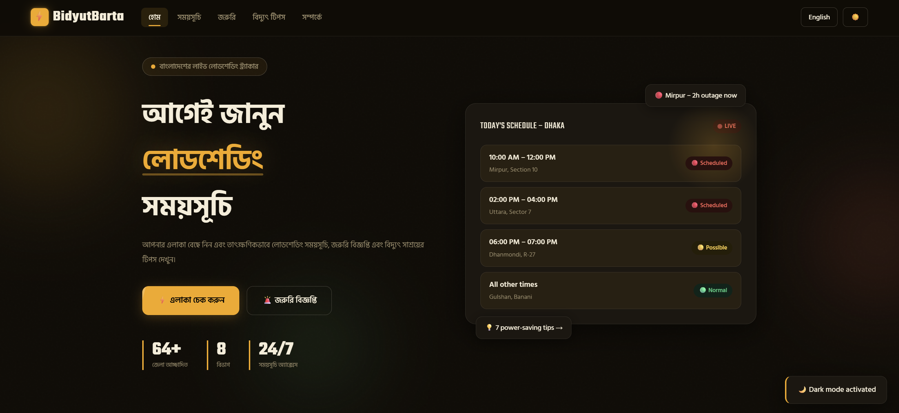
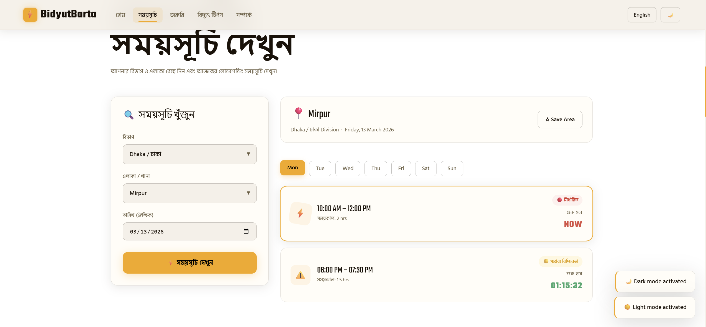
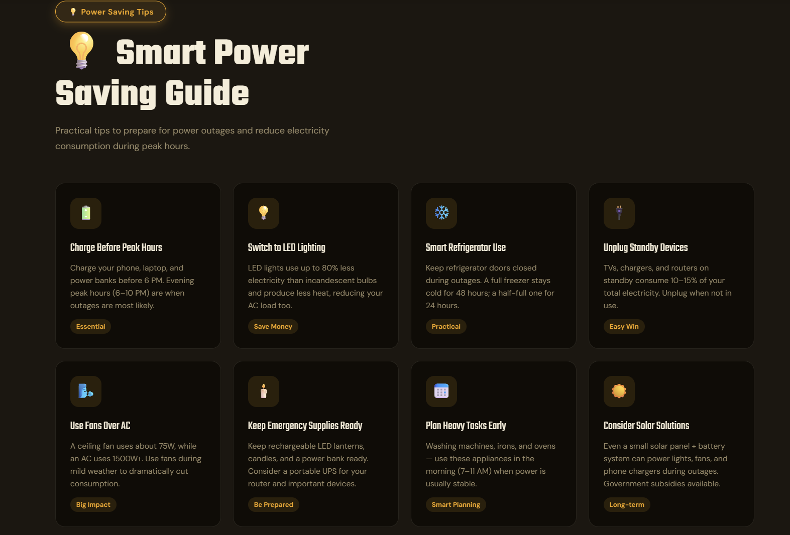
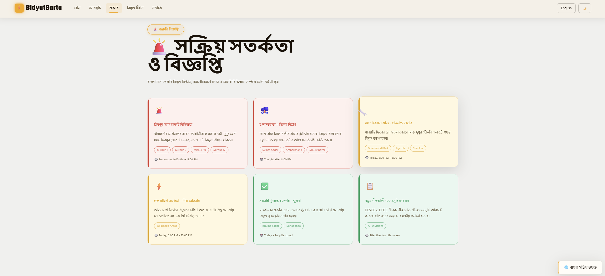
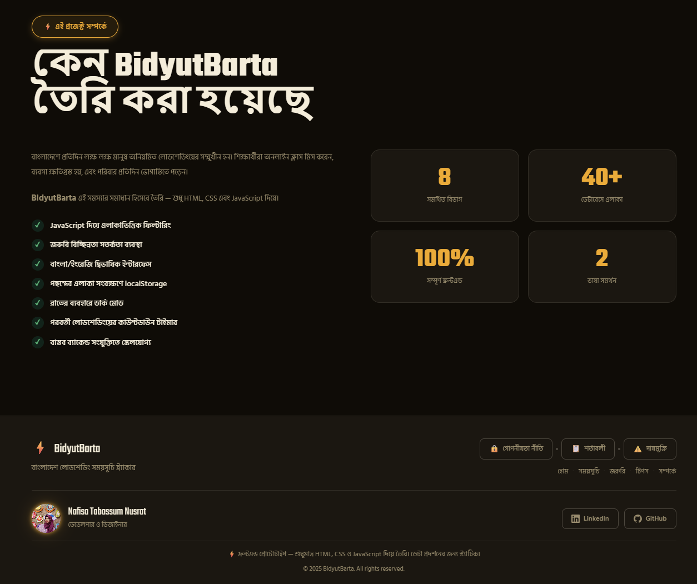

# ⚡ BidyutBarta

---

---

# 🌍 About The Project

**BidyutBarta** is a modern frontend prototype designed to help people in **Bangladesh** easily check **load shedding schedules** for their area.

Every day millions of people face unpredictable power outages.  
Students miss online classes, businesses lose productivity, and families face daily disruption.

This project demonstrates how a **simple web application** can visualize electricity outage schedules in a **clear and user-friendly interface**.

The system allows users to **select their division and area** and instantly see scheduled power cuts, alerts, and tips.

---

# ✨ Features

⚡ Area-wise Load Shedding Schedule Checker  

🚨 Emergency Outage Alert System  

🌙 Dark Mode Support  

🌐 Bangla + English Language Toggle  

⭐ Save Favorite Areas using localStorage  

📊 Modern Dashboard UI with live-style cards  

📱 Fully Responsive for Mobile & Desktop  

💡 Power Saving Tips Section  

---

# 🖼 Project Preview

Add screenshots here after uploading images to GitHub.

Example:

## 📸 Preview

---

# 🛠 Tech Stack

| Technology | Usage |
|-------------|-------------|
| **HTML5** | Structure |
| **CSS3** | Styling & Animations |
| **JavaScript (ES6)** | Logic & Interactivity |
| **localStorage** | Save user preferences |

This project is built using **pure frontend technologies without any frameworks**.

---

No installation required.

---

# 🔮 Future Improvements

⚡ Real-time API integration with electricity boards  

📱 Mobile app version  

🔔 Outage notification system  

🤖 AI based power outage prediction  

🌍 Nationwide live outage map  

---

# 👩‍💻 Developer

**Nafisa Tabassum Nusrat**

🎓 Student — Daffodil International University  
🤖 Future AI Engineer  
🎮 Game Developer  
🧠 AI / ML Enthusiast  

---

### 🔗 Connect With Me

LinkedIn  
https://www.linkedin.com/in/nafisa-tabassum-nusrat-57134721a/

GitHub  
https://github.com/nafisatabassumnusrat

---

# ⭐ Support

If you like this project, please consider giving it a **star ⭐ on GitHub**.

It motivates me to build more useful projects.

---

# 📜 License

